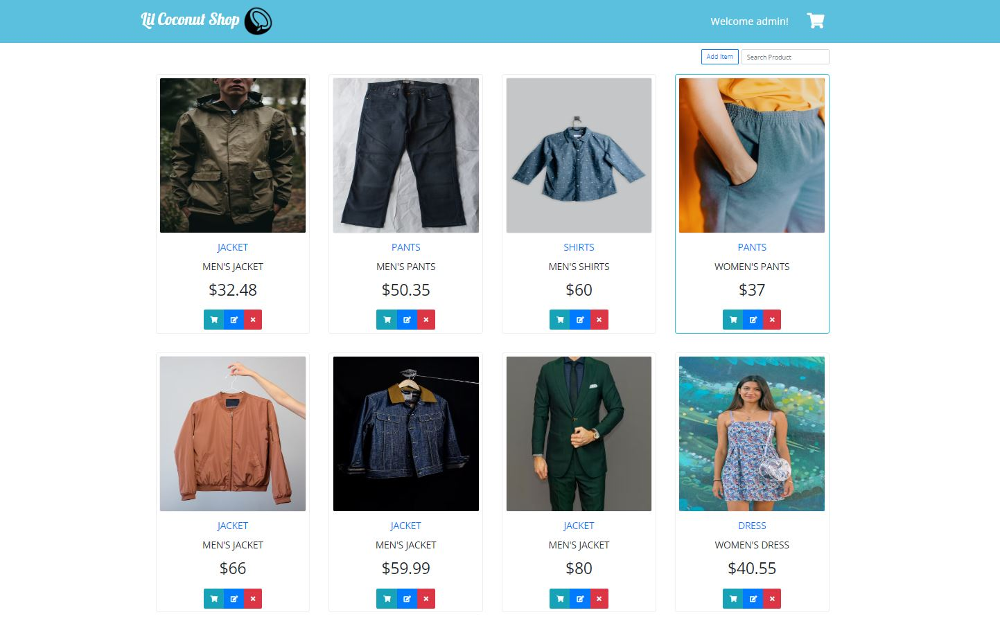
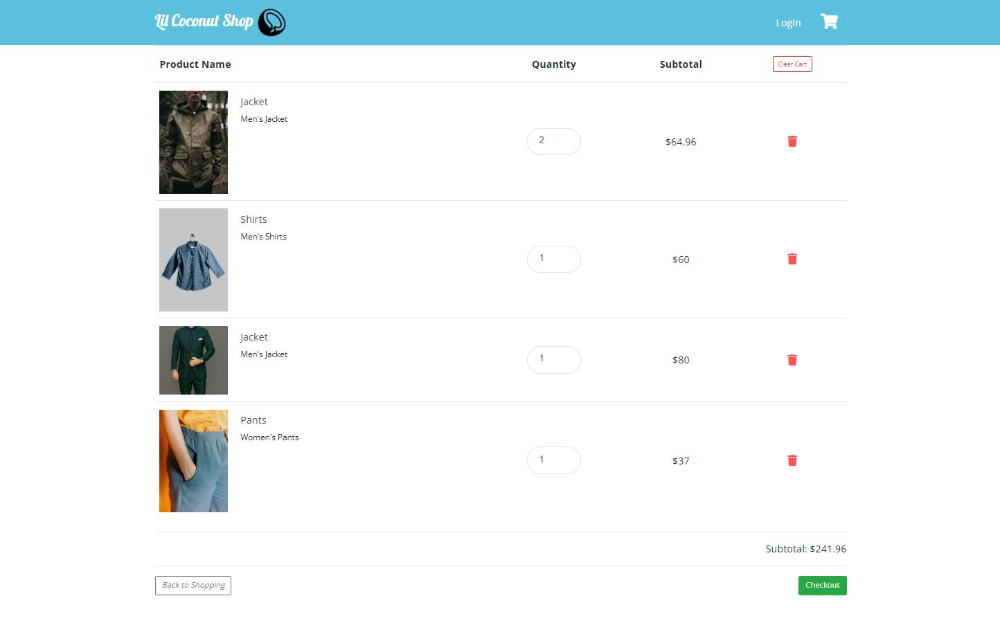

# Lil Coconut Shop
> Lil Coconut Shop is an e-commerce shopping website.


## Screenshots



## Tech/Framework used
<b>Front End</b>
* HTML/CSS/JS
* Angular 12.2
* Bootstrap 4.3
* Node.js 16.16.0

<b>Back End</b>
* C#
* MSSQL

<b>Framework</b>
* ASP.NET Core 6.0
* JwtToken
* Entity Framework

<b>Architecture</b>
* Web API

## Development setup
* Download project
```sh
git clone https://github.com/MyungLee1992/ShoppingWebsiteClient-Angular.git
git clone https://github.com/MyungLee1992/ShoppingWebsiteAPI-.NET.git
```

* Back-End Project
```
open ShoppingWebsiteAPI-.NET in Visual Studio
run the application
```

* Front-End Project
```sh
cd ShoppingWebsiteClient-Angular
ng serve
```
